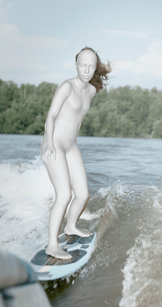
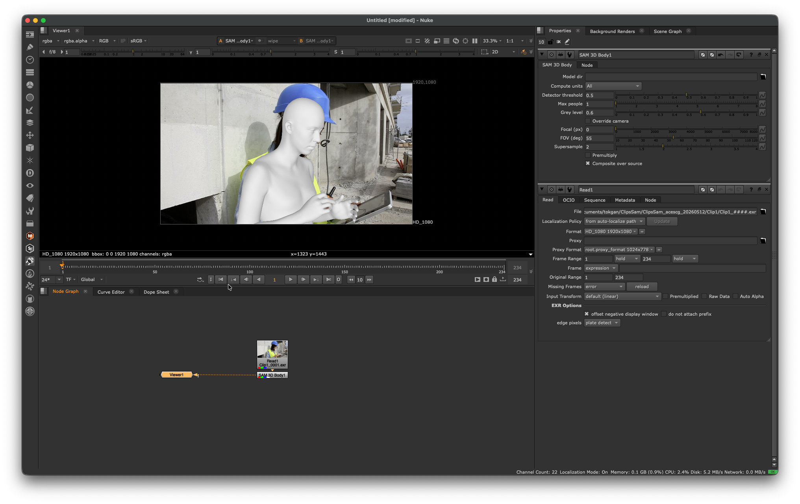
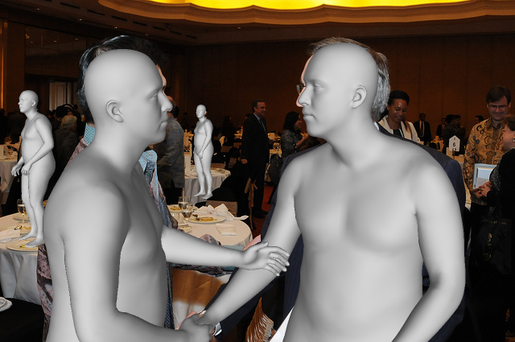
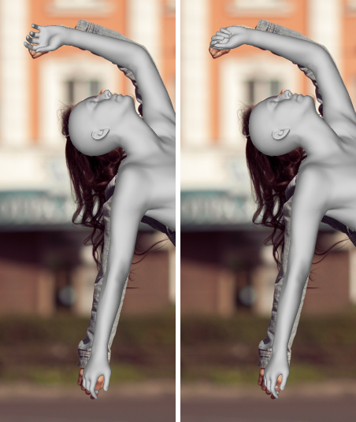
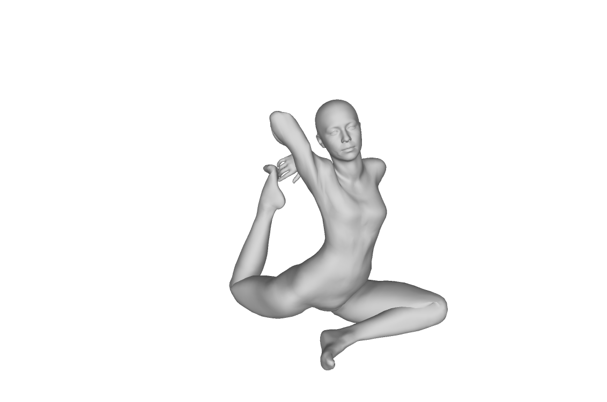

# Hastur — SAM 3D Body as an OpenFX plugin

<p align="center">
  <br>
  <em>Plugin output rendered in <b>Autodesk Flame 2027 (Linux · CUDA)</b> — the recovered grey mesh composited over the source.</em>
</p>

A hardware-accelerated **OpenFX** plugin that runs Meta's **[SAM 3D Body](https://github.com/facebookresearch/sam-3d-body)**
human-mesh-recovery pipeline through **ONNX Runtime** — the **CoreML** execution provider on Apple Silicon and the
**CUDA** execution provider on Linux/Windows (NVIDIA), with automatic CPU fallback. It reconstructs posed 3D human
mesh(es) from a single frame and renders them **in neutral grey with a coverage alpha, at the input-frame resolution**.

> **Status: v0.1.0 released.** The full **multi-person + hands** pipeline runs and renders
> on **macOS (CoreML/CPU), Linux (CUDA) and Windows (CUDA)**, and is validated in-host in **Nuke 16 (macOS)** and
> **Autodesk Flame 2027 (Linux/CUDA)**. This is the SAM-3D-Body counterpart to
> [humbaba](https://github.com/samhodge-tokgan/humbaba) (DepthAnything3) and reuses its cross-platform ORT/OFX scaffold.

- **Input:** RGB(A) frame buffer (sRGB display-referred or ACEScg working space).
- **Output:** an **RGBA** render — neutral-grey shaded humanoid mesh(es) over a transparent (coverage-alpha)
  background, at the input resolution. This is the C++/ORT equivalent of the reference
  `Renderer.__call__(..., return_rgba=True)`.
- **Acceleration:** ONNX Runtime — CoreML EP (macOS), CUDA EP (Linux/Windows), CPU fallback everywhere.

## Validation

The full pipeline is built and run end-to-end on all three platforms:

| Platform | Build | Accelerator | Runtime | Body-regressor |
|---|:---:|---|:---:|---|
| **macOS** arm64 (Apple Silicon) | ✅ | CoreML / CPU | ✅ end-to-end render | ~38 s (CPU-bound¹) |
| **Linux** x86-64 (RTX 3090) | ✅ | **CUDA** | ✅ on-GPU, no fallback | **~0.3 s (~100×)** |
| **Windows** x64 (RTX 3090) | ✅ | **CUDA** | ✅ on-GPU, no fallback | **~1.15 s (~33×)** |

Numeric parity vs the Python reference (fixed bbox): `pred` Pearson **0.999999**, cam_t **0.09 %**, keypoints **1.0 px**,
silhouette IoU **0.97**. ¹On macOS the MHR-refinement ops (GridSample/Scatter/…) fragment the CoreML graph, so the body
stage runs on CPU; CUDA supports them → the large Linux/Windows GPU speedups. Verified in-host in **Nuke 16 on macOS** (below).

<p align="center">
  <br>
  <em>In-host: the <code>SAM 3D Body</code> OFX node in Nuke 16 (macOS) — grey clay mesh composited over the source plate.</em><br><br>
  <br>
  <em>Multi-person — four meshes recovered and depth-ordered over the source.</em><br><br>
  
  
</p>

## Pipeline

```
frame ─▶ person detector (clean ONNX; bboxes only)
      ─▶ per-person crop (TopdownAffine 512², ImageNet norm) + camera conditioning
      ─▶ SAM-3D-Body regressor  (DINOv3-H+ backbone ─▶ SAM decoder ─▶ MHR head + camera head)
      ─▶ (optional, wrist-gated) hand refiner decoder
      ─▶ MHR body model  (C++ FK + LBS + blendshapes ─▶ posed 18,439-vertex mesh)
      ─▶ software rasterizer  (perspective pinhole, neutral-grey Lambert, coverage alpha)
      ─▶ RGBA at input resolution (multi-person = depth-ordered composite)
```

The heavy ViT networks (backbone, decoder, heads, hand refiner) run in **ONNX Runtime**; the orchestration, the
MHR **forward-kinematics + linear-blend-skinning** mesh generation, and the **renderer** are native C++ so the whole
thing runs headless inside a host process on three platforms.

## Models (model-less install)

Hastur ships **no model weights**. Meta's SAM-3D-Body weights are gated on Hugging Face and covered by the custom
**SAM License**; you download them yourself (with your own HF token) and **generate** the plugin's ONNX graphs +
MHR static assets locally. Install flow:

1. **Install the plugin** — run the platform installer (`Sam3dBody-<ver>-macos-arm64.pkg`, built by
   [`packaging/make_pkg.sh`](packaging/make_pkg.sh)) or `cmake --install build`. This stages the plugin into your OFX
   plugin dir — **no weights**.
2. **Generate the models** from your own gated checkpoints with the single wire-up script:
   ```sh
   tools/convert_models.sh \
       --ckpt-dir  /path/to/sam-3d-body/checkpoints/sam-3d-body-dinov3 \
       --out-dir   ~/Library/OFX/Plugins/Sam3dBody.ofx.bundle/Contents/Resources \
       --python    /path/to/torch-env/bin/python
   ```
   (Windows: `tools\convert_models.ps1`.) It runs the `tools/export_*` / `extract_mhr_assets` scripts in order to
   produce `person_detector.onnx`, `sam3dbody_body.onnx`, `sam3dbody_hand.onnx`, `mhr_assets.bin`,
   `pose_corrective.onnx`, `mhr_wrist.bin` (+ json sidecars). The body/hand ViT exports take **hours**.
3. **The plugin finds them** in the bundle's `Contents/Resources`, or in `$HASTUR_MODEL_DIR`, or the *Model directory*
   plugin param.

`tools/fetch_models.{sh,ps1}` is now a thin pointer to `convert_models` (plus an optional `HASTUR_MODELS_BASE_URL`
mirror hook if you host a pre-generated set yourself). See [`docs/MODELS.md`](docs/MODELS.md) for the full flow,
parameters, and legal posture.

## Licensing

Hastur is a **derivative work of Meta's [SAM 3D Body](https://github.com/facebookresearch/sam-3d-body)** and is
distributed under the **SAM License** (see [`LICENSE`](LICENSE)), to match the license of the work it derives from.
Note this is a **custom Meta license, not OSI-approved**: commercial use is permitted, but it carries an Acceptable
Use Policy and a clause (1.b.iv) restricting reverse-engineering — treat local ONNX conversion of the gated weights as
a derivative work you own.

Third-party components retain their own licenses, attributed in [`NOTICE`](NOTICE): the **humbaba** scaffold, **MHR**,
and **Detectron2** (Apache-2.0), the **torchvision ssdlite** detector (BSD-3), **ONNX Runtime** (MIT), **Eigen**
(MPL-2.0), the **OpenFX SDK** (BSD-3), and **stb** (public domain). **DINOv3** (embedded in the SAM-3D-Body checkpoint)
has its own gated Meta license.

Hastur is **model-less** — it ships no Meta weights; you generate the ONNX/assets locally from your own gated
checkpoint (see [`docs/MODELS.md`](docs/MODELS.md)). Whether the *converted* weights may be redistributed is being
clarified with Meta (opensource@meta.com).

## Roadmap

Development is milestone-per-PR (see [`docs/BACKLOG.md`](docs/BACKLOG.md) for the full plan). Highlights:
M0 bootstrap → M1 detector swap → M2 MHR in C++ → M3 backbone/decoder export → M4 C++ scaffold → M5 body-only
end-to-end (macOS) → M6 rasterizer → M7 hands → M8 multi-person → M9 Linux/Windows CUDA → M10 packaging + legal →
**M11 = 0.1.0 public release** (multi-person + hands, all three OS).

## Building

Requires CMake ≥ 3.20 and a C++17 compiler; the OpenFX SDK and per-platform ONNX Runtime are fetched by CMake. Same
invocation on every platform (toolchain differs) — see [`docs/LINUX.md`](docs/LINUX.md) / [`docs/WINDOWS.md`](docs/WINDOWS.md).

```sh
cmake -S . -B build -DHASTUR_WITH_ONNX=ON -DCMAKE_BUILD_TYPE=Release
cmake --build build -j
```

Produces `build/Sam3dBody.ofx.bundle` (OFX layout `Contents/{MacOS,Linux-x86-64,Win64,Frameworks,Resources}`).
